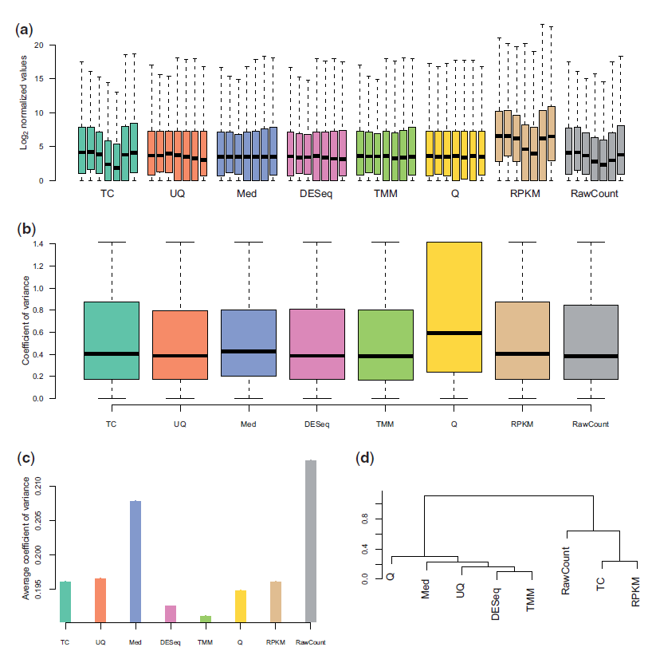
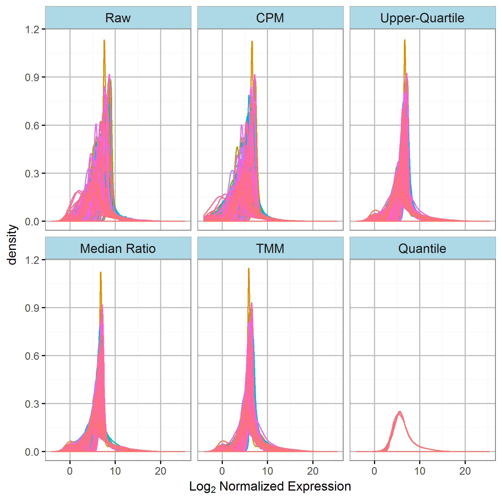
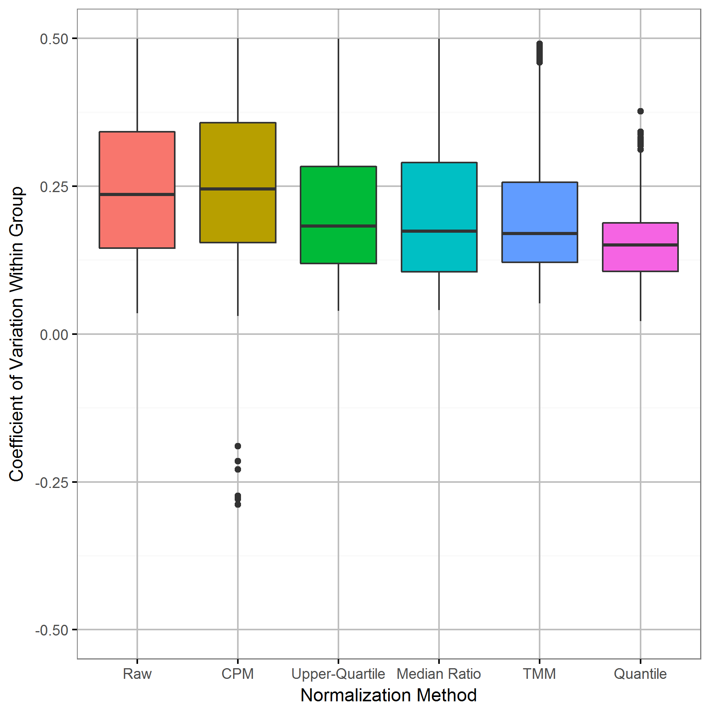

Normalization of High-throughput Data for Clinical Testing
========================================================
author: Dominic LaRoche 
date: 22-Jul-2018
autosize: true
css: ./CCC/bootstrap.css

Why do we need normalization?
========================================================

High-throughput measurements systems include a lot of technical variation.

- Uneven library sizes for RNA seq
- Batch effects
- etc.

Normalization attempts to remove tehcnical variation while preserving biological variation.

Normalization Methods Discussed Today
========================================================

There are many methods available:

- Counts per Million (CPM)
- Total Count (TC)
- Upper Quartile (UQ)
- Median Ratio (MR)
- Trimmed Mean of M-values (TMM)
- Quantile

Notation
========================================================
I will use the framework of RNA-Seq but the methods are translatable to other measurement systems.

We assume an experiment in which measurements for $P$ probes are made on a set of $K$ samples.

- $Y_{gk}$ refers to the count (measurment) for probe $g$ in sample $k$.
- $\hat{Y}_{gk}$ refers to the normalized count for probe $g$ in sample $k$.
- $N_k$ is the total number of reads for sample $k$

The Normalization Problem
========================================================
The goal of normalization is to remove technical variation so that variation between samples is solely due to biology.

Frame the problem with GLM:

$log(E[Y_{gk}|d_k]) = log(d_k) + \lambda_{a(k), g} + \Theta_{gk}$

- $\lambda_{a(k),g}=$ True expression level for gene $g$ in sample $k$ based on biological condition $a$
- $log(d_k) =$ Some offset for total sample reads
- $\Theta_{gk} =$ Other technical effects

Counts per Million and Total Count
========================================================

CPM and TC normalizations are really more accurately described as "Standardizations."

The goal of both methods is to standardize the individual probe counts by accounting for the total number of counts allocated to each sample, $N_k$.  
- CPM:
  - $\hat{Y}_{gk} = \frac{Y_{gk}+0.5}{N_k+1} \times 10^6$
  
- Total Counts:
  - $\hat{Y}_{gk} = \frac{Y_{gk}}{N_k} \times \frac{\sum_1^K N_k}{K}$

Upper Quartile
========================================================
Upper quartile normalization was proposed by Bullard et al. (2010) to reduce the impact of a small number of high counts.

$\hat{Y}_{gk} = \frac{Y_{gk}}{Q^{75}(Y_{.k})}$, 

where,

$Q^{75}(Y_{.k})=$ The 75th percentile of the counts in sample $k$ after removing 0's

Median Ratio
========================================================
The median ratio method of normalization was proposed by Anders and Huber (2010) as part of their model for differential expression of RNA-Seq data.  
- Assume most probes do not have different expression.
- Expect the ratio of expected counts for most probes between two samples to be the same as the ratio of some scaling factor, $s$.

$$\frac{EY_{ig}}{EY_{k'g}} = \frac{s_{k}}{s_{k'}}$$

Median Ratio
========================================================
- Estimate the size factor using the median ratio method

$$\hat{s}_k = \text{median}\frac{Y_{gk}}{\left(\prod_{v=1}^KY_{vg}\right)^{1/K}}$$

- Divide each count by corresponing scale factor to normalize

$$\hat{Y}_{gk} = \frac{Y_{gk}}{\hat{s}_k}$$

Trimmed Mean of M-values
========================================================
Robinson and Oshlack (2010) proposed the TMM method using similar logic to Anders and Huber, i.e. most probes should not have different expression.

- First define the gene-wise log-fold-changes ($M$-values) as:

$$M_g = log_2 \frac{Y_{gk}/N_{k}}{Y_{gk\prime}/N_{k\prime}},$$

- Assume absolute expression levels ($A$-values) defined as (assuming absolute expression is the same for both samples)

$$A_g = \frac{1}{2}log_2\left(Y_{gk}/N_k \cdot Y_{gk\prime}/N_{k\prime} \right)\text{ for }Y_{g\bullet} \ne 0,$$

Trimmed Mean of M-values
========================================================
- Both the $M$-values and $A$-values are trimmed removing the upper and lower 30% of the $M$-values and the upper and lower 5% of the $A$-values

-  The resulting normalization factor for sample $s$ is then a weighted average of the $M$-values calculated from a reference sample:

$$\hat{Y}_{gk} = \frac{ \sum_{g \in G} w^r_{gk}M^r_{gk}}{\sum_{g \in G} w^r_{gk}},$$

$$M^r_{gk} = log_2\frac{Y_{gk}/N_{k}}{Y_{gr}/N_{r}}, \ Y_{gk}, Y_{gr} > 0\text{, for reference sample }r, $$

$$w^r_{gk} = \frac{N_k-Y_{gk}}{N_kY_{gk}} + \frac{N_r-Y_{gr}}{N_rY_{gr}}, \text{ for } Y_{gk}, Y_{gr} > 0.$$

Quantile Normalization
========================================================
Quantile normalization was first introduced by Bolstad et al. (2003) in the context of microarray experiments but has been adapted to a number of other applications.

- Constrains all quantiles of every sample to be the same
- Assumes all differences in distribution among samples due to technical variation
- Sort each sample by expression 
- Calculate the reference distribution, $R$, as the mean of the sorted distributions

$$\hat{Y}_{gk} = R_{\text{rank}_y(g)}$$

- Each sample becomes a permutation of the reference sample

General Classes of Normalizations
========================================================
All of these normalization methods can be grouped into two categories:

1. Scaling normalizations 
  - Generate a scale factor for each sample to re-scale the counts
  - May not adequately remove technical variation among samples

General Classes of Normalizations
========================================================
All of these normalization methods can be grouped into two categories:

1. Scaling normalizations
  - Generate a scale factor for each sample to re-scale the counts
  - May not adequately remove technical variation among samples
  
2. Constraining normalizations
  - Constrain the distribition of each sample to some reference distribution
  - May not be applicable if there is a *biological* difference in the distributions among sample types
    - Diseased and healthy samples may have meaningful differences in distribution  
  
  
Performance of Normalization Methods
========================================================

***
From Dillies et al. 2012

(a.) Boxplots for all conditions and replicates in mouse data

(b.) Boxplot of intragroup variance

(c.) CV of housekeeping genes in humans

(d.) Similarity of differential expression results

Performance of Normalization Methods
========================================================

***

- Quantile normalization often results in better classification (anecdotally!)
- Papers have variously recommended different normalizations
- (Personal Opinion) Choice of normalization is data dependent

Performance of Normalization Methods
========================================================

***

- These results differ from Dillies et al.
- Dillies et al. might have violated distributional assumption?
- Hicks and Irrizay (2014) propose a method for determinig whether constraining normalizations are appropriate.  (R package *quantro*)

Applying Normalization in the Clinical Setting
========================================================
The ultimate goal of many analyses of high-thoughput data is to generate a clinical diagnostic.

- Applying normalizations to individual clinical samples can be difficult

  - CPM, TC, and UQ are appealing options becuase they are applied at the sample level and no other information is required

  - Other scale factor normalizations are "batch-applied", making the normalization of new samples difficult

  - Some methods, such as TMM, require a "reference sample", which can be hard to identify
  
Applying Normalization in the Clinical Setting
========================================================
The ultimate goal of many analyses of high-thoughput data is to generate a clinical diagnostic.

- Applying normalizations to individual clinical samples can be difficult
  
  - CPM, TC, and UQ are appealing options becuase they are applied at the sample level and no other information is required
  
  - Other scale factor normalizations are "batch-applied", making the normalization of new samples difficult
  
  - Some methods, such as TMM, require a "reference sample", which can be hard to identify
  
- Incorporating the normalization into the diagnostic prediction model is one possible solution
  
  - Must be capable of being applied to individual samples measured in a testing lab
  
  - Must be validated as part of the diagnostic procedure

  
Quantile Normalization for Clinical Testing
========================================================

Quantile normalization can be incorporated into the diagnostic model.

- Generate reference distribution with the same samples used to train the model

- Normalize all new samples using the same reference distribution

- If it works for the testing and validation data, it should work for new samples??

Discussion
========================================================
- What else might need to be considered for clinical samples?

- Are there other classes of normalizations not mentioned here?

