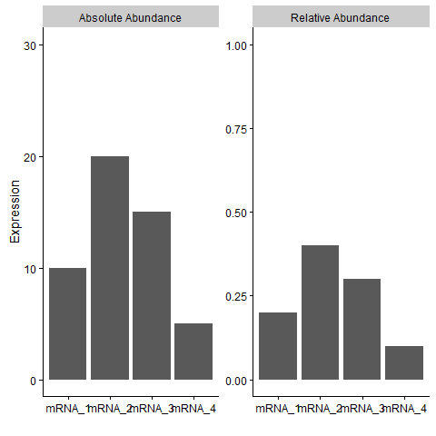

What *is* a Composition?
========================

Lets first start with the definition of a composition , since many readers may not be familiar with that term outside of their high school writing course. In statistics, a composition is a set of measurements that sum to an arbitrary whole. These measurements are therefore proportions of the whole and are, by definition, not independent. If you increase one part of a composition the other parts must decrease proportionally. This idea is visualized in the graphic below.

A classic example of a composition comes from the study of rocks (otherwise known as mineralogy). Rocks are usually classified by what they are made of, e.g. granite is a mixture of quartz and feldspar. The exact mixture, or proportions, of these ingredients provides further classification. Clearly, the total amount of quartz and feldspar will depend on the size of the rock in question. Two identical specimens of different sizes will be expected to have the exact same proportions, but the total weight of any part is a function of the size of the rock and provides little information about the type of rock.

This all seems very obvious when considering the composition of a rock. But compositions arise in many other scientific pursuits and the compositional properties of the measurements are frequently ignored. For example, in metabolomics a sample is collected and the quantities of certain metabolites are measured, usually as proportions. Or in economics one might study the spending habits of consumers, but the total amount spent might not be as informative as the proportion of an individual consumer's total income. Additionally, many of the technologies at the forefront of the push for 'personalized medicine' result in compositional data. Most notably RNASeq, which measures the expression patterns of an individual's genes, generates relative abundances of gene transcripts with the total number of each transcript depending on several technical or experimental factors which are of no interest biologically.

Why should I care about compositions?
=====================================

Compositional data are non-negative data which are subject to a sum constraint, i.e. all the elements must sum to unity. This simple constraint has some important consequences for many standard statistical methodologies including correlation and regression. Compositional data contain only relative information, i.e. the information about any individual component, or group of components, is relative to the other components and no absolute information about the absolute value of the component. It is, therefore, important to recognize the types of inferences that can be made from compositional data, e.g. no inference can be made on the actual abundances.

Potential problems associated with compositional data were identified as early as 1897 by Karl Pearson who noted that spurious correlations can be induced through ratios of independent variables, e.g. if *X*, *Y*, and *Z* are uncorrelated then *X*/*Z* and *Y*/*Z* will be correlated. John Aitchison identified a number of additional issues in his seminal book on compositions published in 1986 including: the variance-co-variance matrix, regression coefficients, and multivariate methods such as principle components analysis or distance metrics.

How much should you worry if your data is compositional? What if the sum constraint is really large? What if the number of components is really large? I will attempt to address these common questions in some future posts. If you have a burning question about compositions leave a comment below!
